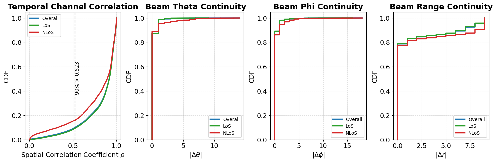

# Multimodal-NF Dataset Generator

**Multimodal-NF** is a generation pipeline for low-altitude near-field XL-MIMO sensing and communications. It produces synchronized **near-field CSI**, **RGB images**, **LiDAR point clouds**, **GPS/trajectory information**, and **wireless labels** for UAV communication scenarios.

This README provides a concise overview of the dataset generation workflow, environment setup, data schema, and basic statistics. For more detailed descriptions, visual examples, benchmark tasks, and dataset documentation, please refer to our project website: **https://lmyxxn.github.io/6GXLMIMODatasets/**

## 🔗 Links

- **Project page:** https://lmyxxn.github.io/6GXLMIMODatasets/
- **Dataset and codebooks:** https://huggingface.co/datasets/lmyxxn/MultimodalNF
- **Paper:** https://ieeexplore.ieee.org/abstract/document/11558356

## 1. Overview

The pipeline supports:

- Near-field XL-MIMO channel generation with a BS UPA array.
- Low-altitude UAV trajectory generation and synchronization.
- Ray-tracing-based wireless channel synthesis using Sionna RT.
- Synchronized RGB and LiDAR sensing data generation.
- Beam-label generation with near-field beamforming codebooks.
- Dataset packing into `.h5` files for downstream learning tasks.
- Statistical analysis of LoS/NLoS ratio, multipath statistics, delay spread, and temporal consistency.

## 2. Environment

The default environment is based on **Python 3.10.18** and **CUDA 12.1**.

Main dependencies:

```text
sionna-rt==1.1.0
mitsuba
tensorflow==2.13.1
torch==2.4.1+cu121
torchvision==0.19.1+cu121
torchaudio==2.4.1+cu121
open3d==0.19.0
opencv-python==4.12.0.88
osmnx
geopandas
pyvista
h5py
numpy
matplotlib
```

Install the core Python packages according to your CUDA/PyTorch environment. The PyTorch CUDA version should match the local GPU driver.

## 3. Dataset Generation Workflow

### Step 1: Scene and Trajectory Generation

Run:

```text
OSM_to_SionnaScene.ipynb
```

This notebook constructs the 3D urban scene, defines the simulation boundary, places the BS, and generates UAV trajectories.

### Step 2: Channel and Multimodal Data Generation

Run:

```bash
python channel_generation.py
```

This script generates near-field wireless channels and synchronized multimodal data.

Main configurable items include:

- Carrier frequency
- BS antenna array size
- UAV trajectory mode
- Scene geometry
- Ray-tracing depth
- LoS/reflection settings
- Beam codebook path

Required codebooks:

```text
upa64x64_NF_codebook.pkl
upa64x64_NF_codebook_small.pkl
```

Download them from:

```text
https://huggingface.co/datasets/lmyxxn/MultimodalNF
```

and place them in the main project folder.

### Step 3: Data Packing

Run:

```bash
python pick_image_to_h5.py
python pick_lidar_to_h5.py
```

These scripts pack RGB images and LiDAR point clouds into `.h5` files.

### Step 4: Dataset Statistics

Run:

```bash
python stastics_analysis.py
```

Generated outputs include:

```text
dataset_comprehensive_stats.csv
dataset_health_dashboard.png
```

## 4. Dataset Configuration

Default generation setup:

| Item | Value |
|---|---|
| Scene size | `120 m × 120 m` |
| Building height | `20–60 m` |
| BS position | `(0, 0, 65) m` |
| BS array | UPA `64 × 64`, half-wavelength spacing |
| Carrier frequency | `7 GHz` |
| Subcarrier spacing | `30 kHz` |
| Number of subcarriers | `128` |
| Trajectory length | `T = 20` frames |
| Sampling interval | `0.1 s` |
| UAV altitude | `5–80 m` |
| Ray tracing | LoS and specular reflections |
| Maximum interaction depth | `3` |
| Materials | ITU-concrete, ITU-marble, ITU-wood, ITU-metal, medium dry ground |

## 5. Dataset Schema

Each sample contains synchronized wireless and sensing modalities.

| Modality | Components |
|---|---|
| Wireless | CSI tensor `H ∈ R^{M × K × T × 2}`, binary LoS label, Top-5 beam indices, normalized beamforming gains |
| GPS | Noisy 3D UAV coordinates |
| RGB | Camera image, FoV `90°`, resolution `512 × 512` |
| LiDAR | 10,000-point cloud co-located with the camera |
| Trajectory | Trajectory ID among 10 UAV kinematic modes |

The complex CSI is stored with real and imaginary parts stacked in the last dimension.

## 6. Dataset Splits

The released dataset is split by cities to test cross-environment generalization.

| Split | Mode | Cities | Trajectories | Samples | LoS | NLoS |
|---|---|---:|---:|---:|---:|---:|
| Train | Easy | 22 | 2,614 | 52,280 | 49,923 | 2,357 |
| Train | Hard | 22 | 5,185 | 103,700 | 94,251 | 9,449 |
| Val | Easy | 4 | 488 | 9,760 | 9,374 | 386 |
| Val | Hard | 4 | 988 | 19,760 | 19,139 | 621 |
| Test | Easy | 4 | 494 | 9,880 | 9,381 | 499 |
| Test | Hard | 4 | 1,001 | 20,020 | 19,007 | 1,013 |
| **Total** | -- | **30** | **10,770** | **215,400** | **201,075** | **14,325** |

Overall LoS/NLoS ratio:

```text
LoS:  93.35%
NLoS:  6.65%
```

## 7. UAV Trajectory Modes

| ID | Mode | Horizontal / Vertical Velocity | Altitude | Description |
|---:|---|---|---|---|
| 1 | Zigzag | `0–5 / 0–1.5 m/s` | `5–15 m` | Sinusoidal weaving |
| 2 | Wall Hug | `5–15 / 0 m/s` | `5–20 m` | Building perimeter tracking |
| 3 | Inspect | `0 / 0–2 m/s` | `2–60 m` | Vertical facade scanning |
| 4 | Sudden Turn | `8–12 / 0–2 m/s` | `5–45 m` | Abrupt street-level turns |
| 5 | Street Patrol | `8–12 / 0–2 m/s` | `5–45 m` | Road-network traversal |
| 6 | Hover | `0 / 0–0.5 m/s` | `10–80 m` | Quasi-stationary drift |
| 7 | City Cruise | `8–15 / 0 m/s` | `30–60 m` | Smooth linear crossing |
| 8 | Orbit | `0–10 / 0 m/s` | `30–60 m` | Circular flight |
| 9 | Fast Transit | `15–25 / 0 m/s` | `50–80 m` | High-speed transition |
| 10 | Scan | `0–12 / 0 m/s` | `50–80 m` | Grid scanning |

## 8. Multipath Statistics

The dataset is LoS-dominant but includes non-negligible reflection and blockage cases.

| Metric | Mean | Median | 90th Percentile |
|---|---:|---:|---:|
| Number of paths | 2.53 | 2.00 | 4.00 |
| RMS delay spread | 2.17 ns | 1.38 ns | 4.81 ns |
| Maximum excess delay | 112.77 ns | 95.68 ns | 244.95 ns |
| PDP T50 | 1.03 ns | -- | -- |
| PDP T90 | 2.28 ns | -- | -- |
| K-factor | 52.01 dB | 59.72 dB | 75.30 dB |

## 9. Temporal Consistency

The dataset preserves trajectory-level continuity. Consecutive frames have high spatial-domain channel correlation, and near-field beam indices evolve smoothly across azimuth, zenith, and range dimensions.

This supports tasks such as:

- Temporal channel prediction
- Beam tracking
- Multimodal sensing-aided communication
- UAV mobility-aware link adaptation



## 10. Codebooks

Provided near-field beamforming codebooks:

| File | Size | Usage |
|---|---:|---|
| `upa64x64_NF_codebook.pkl` | `90 × 45 × 16` | Dense beam-label generation |
| `upa64x64_NF_codebook_small.pkl` | `20 × 20 × 10` | Fast testing and low-memory runs |

Download:

```text
https://huggingface.co/datasets/lmyxxn/MultimodalNF
```

## 11. Citation

If you use this dataset or generation pipeline, please cite:

```bibtex
@article{2026MultimodalNF,
author  = {M. Li and Q. Lu and J. Tian and H. Hu and Y. Han and X. Li and C.-K. Wen and S. Jin},
title   = {{Multimodal-NF}: A Wireless Dataset for Near-Field Low-Altitude Sensing and Communications},
journal = {IEEE Wireless Communications Letters},
year    = {2026},
note    = {early access},
doi     = {10.1109/LWC.2026.3702704}
}


```
